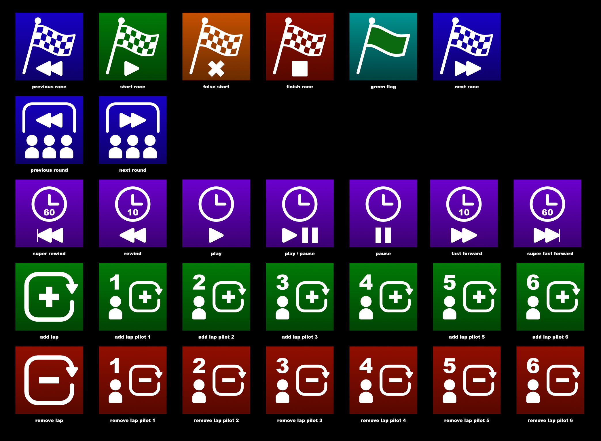

# fpv.streamdeck.icons
Stream Deck icon set for FPV race directors

Included here is a zip file containing a simple setup for using FreeTouchDeck (and ESP32-TouchDown) with Livetime FPV for managing races. I use the ESP32-TouchDown as a Bluetooth keyboard, which lets me start/restart a race from my pilot's seat, without having to be at the computer itself. The Karl33to icons are converted to 75px x 75px BMPs

